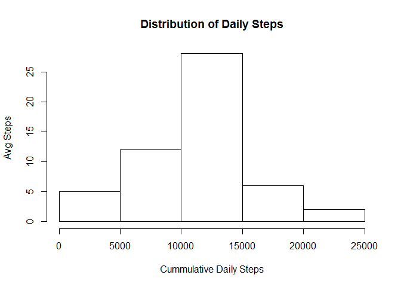
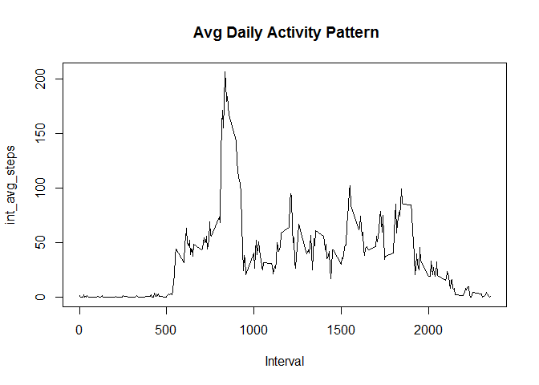
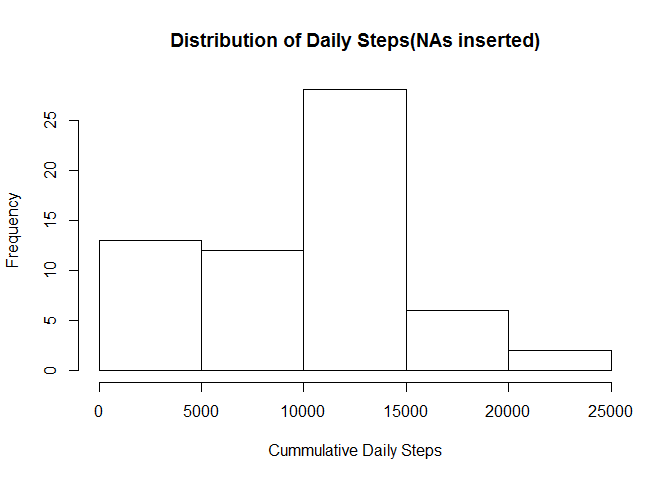
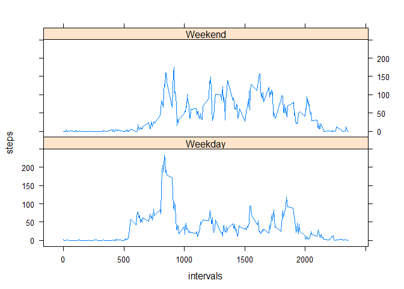

# Reproducible Research: Peer Assessment 1


## Loading and preprocessing the data
*Have set Working Directory to the Cloned Folder  in Global Options*


```r
     unzip("./activity.zip")
     activityData<-read.csv("./activity.csv",header =TRUE,
                            stringsAsFactors =FALSE)
```


## What is mean total number of steps taken per day?
**Task1 : Histogram of Total Steps**  
*Calcultaing the Number of Steps per Day and making a Histogram*  
*Using Library dplyr*

```r
     library(dplyr,quietly=TRUE)
```

```
## 
## Attaching package: 'dplyr'
## 
## The following object is masked from 'package:stats':
## 
##     filter
## 
## The following objects are masked from 'package:base':
## 
##     intersect, setdiff, setequal, union
```

```r
     steps<-group_by(activityData,date)
     dailySteps<-summarise(steps,total_Steps =sum(steps))
     hist(dailySteps$total_Steps,main="Distribution of Daily Steps",
          xlab ="Cummulative Daily Steps",ylab ="Avg Steps")
```

 

**Printing Mean and Median of the Daily Steps**

```r
     mean(dailySteps$total_Steps,na.rm =TRUE)
```

```
## [1] 10766.19
```

```r
     median(dailySteps$total_Steps,na.rm =TRUE)
```

```
## [1] 10765
```

## What is the average daily activity pattern?
**Task 2: Average  Daily Activity Pattern and interval of Max Activity**


```r
interval_activity<-group_by(activityData,interval)
     avg_steps<-summarise(interval_activity,
                             int_avg_steps =mean(steps,na.rm =TRUE))
     with(avg_steps,plot(interval,int_avg_steps,type ="l",
                          main=" Avg Daily Activity Pattern",xlab ="Interval"))
```

 

```r
     avg_steps[avg_steps$int_avg_steps==max(avg_steps$int_avg_steps),]$interval
```

```
## [1] 835
```


## Imputing missing values

**Task 3: Input Missing Values using interval medians, Histogram**

```r
     count(activityData[is.na(activityData$steps),])
```

```
## Source: local data frame [1 x 1]
## 
##      n
## 1 2304
```

```r
     median_steps<-summarise(interval_activity,
                     int_median_steps =median(steps,na.rm =TRUE))
```
*Function for Inserting Data from the interval Median Summary*

```r
  insertData<-function(df11,df22)
    {for(index in 1:nrow(df11))
     {if(is.na(df11[index,"steps"]))
        {df11[index,"steps"]<-(df22[df22$"interval"== df11[index,"interval"],])$int_median_steps}
              
    } 
   df11
}
```
*Filling in the missing Values into a new Data Frame and Making a Histogram*

```r
   activityDataComplete<-insertData(activityData,median_steps)
   count(activityDataComplete[is.na(activityDataComplete$steps),])
```

```
## Source: local data frame [1 x 1]
## 
##   n
## 1 0
```

```r
   stepsModified<-group_by(activityDataComplete,date)
   dailySteps1<-summarise(stepsModified,total_Steps =sum(steps))
   hist(dailySteps1$total_Steps,main="Distribution of Daily Steps(NAs inserted)",
     xlab ="Cummulative Daily Steps")
```

 

```r
     a<- mean(dailySteps$total_Steps,na.rm =TRUE) 
     b<- mean(dailySteps1$total_Steps,na.rm =TRUE)
     c<- median(dailySteps$total_Steps,na.rm =TRUE) 
     d<- median(dailySteps1$total_Steps,na.rm =TRUE)
   matrix(c(a,b,c,d),2,2, dimnames = list(c("Original Data Set","Completed Data Set"),c("Mean","Median")))
```

```
##                         Mean Median
## Original Data Set  10766.189  10765
## Completed Data Set  9503.869  10395
```

## Are there differences in activity patterns between weekdays and weekends?
*Task 4 Activity Patterns using an additonal Column and Panel Printing*

```r
## Copied frrom the internet    
   activityData$wend <-as.factor(ifelse(weekdays(as.Date(activityData$date)) %in% 
                                  c("Saturday","Sunday"), "Weekend", "Weekday"))
      steps<-group_by(activityData,wend,interval)  
      weeklysteps<-summarise(steps,avg_steps=mean(steps,na.rm =TRUE))
      library(lattice)
      xyplot(weeklysteps$avg_steps ~ weeklysteps$interval | weeklysteps$wend, 
                layout = c(1, 2),type ="l",xlab ="intervals",ylab="steps")
```

 
###End of Assignment
